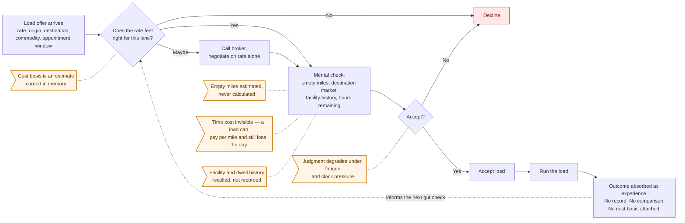

# Load Acceptance Decision — As-Is / To-Be Workflow Map

**Process owner:** Christopher D. Sheppard · **Scope:** single owner-operator flatbed business (Iron Hills Transportation LLC)
**Companion to:** [Freight Load Selection & Profitability Model](https://github.com/christopher-sheppard/freight-load-selection-model)
**Notation:** Mermaid flowchart · **Version:** 1.0

---

## Why this map exists

The load acceptance decision was made several thousand times over eight years and never written down. It lived entirely in the operator's head, which made it impossible to audit, impossible to teach, and least reliable at exactly the moments it mattered most — end of a long day, expiring clock, empty truck.

This map documents the decision as it actually was, then as it was rebuilt. The rebuild is not a workflow redesign on paper; it is the process currently in use, and it is the process the published model implements.

---

## Figure 1 — As-Is: undocumented judgment

### Failure points in the as-is process

| # | Failure point | Consequence |
| --- | --- | --- |
| 1 | No documented all-in cost per mile | "Profitable" was measured against a number that had never been reconciled to settlement records |
| 2 | Deadhead estimated rather than calculated | Empty miles consumed fuel, hours, and equipment life without appearing in the decision |
| 3 | Time committed never priced | Loads that paid acceptably per mile could still consume a disproportionate share of a finite legal operating day |
| 4 | Facility behavior held in memory | Repeat dwell offenders were re-accepted after enough time passed |
| 5 | No override for disqualifying conditions | A strong rate could carry a load that was legally infeasible or economically negative |
| 6 | No decision record | Nothing to reconcile, compare, correct, or hand to anyone else |

---

## Figure 2 — To-Be: gated decision with a reconciliation loop

```mermaid
flowchart LR
    A["Load offer arrives"] --> B["Capture inputs:<br/>loaded miles, deadhead miles, revenue,<br/>hours committed, commodity, appointment"]
    B --> C["Calculate three measures:<br/>net dollars per total mile<br/>net dollars per hour committed<br/>deadhead percentage"]

    C --> G1{"GATE 1<br/>Net contribution<br/>negative?"}
    G1 -->|Yes| X["DECLINE<br/>gate override —<br/>weighted score never calculated"]
    G1 -->|No| G2{"GATE 2<br/>Deadhead above<br/>configured tolerance?"}
    G2 -->|Yes| X
    G2 -->|No| G3{"GATE 3<br/>Legally infeasible or<br/>blacklisted facility?"}
    G3 -->|Yes| X

    G3 -->|No| J["Record five judgment measures:<br/>destination value and reload strength,<br/>dwell and facility risk, securement burden,<br/>route conditions, HOS and appointment feasibility"]
    J --> S["Weighted score<br/>against threshold bands"]
    S --> D{"Score band"}

    D -->|Above band| ACC["ACCEPT"]
    D -->|In band| NEG["NEGOTIATE to target rate"]
    D -->|Below band| X

    NEG --> R{"Revised rate<br/>clears the band?"}
    R -->|Yes| ACC
    R -->|No| X

    ACC --> L["Log the load:<br/>inputs, calculated measures,<br/>judgment scores, decision"]
    L --> RE["Periodic reconciliation<br/>against settlement records"]
    RE --> CO["Correct cost inputs,<br/>version the model,<br/>publish the change and the reason"]
    CO -.->|"corrected cost basis feeds the next decision"| C

    classDef gate fill:#FFF4E5,stroke:#C77700,stroke-width:2px,color:#5C3A00;
    classDef stop fill:#FDE7E7,stroke:#B42318,stroke-width:1px,color:#7A1710;
    classDef go fill:#E7F5EC,stroke:#1E7B45,stroke-width:1px,color:#0F4527;
    classDef loop fill:#EAF0FA,stroke:#1F3864,stroke-width:1px,color:#14264A;
    class G1,G2,G3 gate;
    class X stop;
    class ACC go;
    class L,RE,CO loop;
```

---

## What changed, and why

| Change | As-is | To-be | Reason |
| --- | --- | --- | --- |
| Cost basis | Remembered estimate | Calculated from reconciled settlement history | The remembered number was wrong in five separate ways, including a truck payment for equipment owned outright |
| Empty miles | Eyeballed | Calculated as a percentage of total miles and charged against the load | Empty miles are real cost and lost capacity, not a rounding difference |
| Time | Not considered | Net dollars per hour committed | Exposes loads that pay per mile but consume the operating day |
| Disqualifying conditions | Tradeable against a good rate | Three hard gates evaluated **before** the weighted score | A weighted average must never rescue a load that is negative, excessively empty, or legally impossible |
| Judgment | Implicit | Five named measures, recorded per load | Judgment is legitimate input; unrecorded judgment is not auditable |
| Outcome | Absorbed as experience | Logged, then reconciled against settlements | Creates the feedback loop that found the errors |
| Corrections | Silent | Versioned and published with the reason | A model nobody can check is a model nobody should trust |

### The one design decision worth defending

**Gates run before the score, not after.** A weighted model that evaluates disqualifying conditions as scored dimensions will eventually approve a load that is negative, illegal, or headed to a facility already designated unacceptable — because strong performance elsewhere pulls the average up. Separating override conditions from scored conditions is the difference between a scoring exercise and an operating decision.

---

## Evidence boundary

This is a single-operator process serving one business. It is documented from real operating records, not from an industry template.

- The current model is built on **18 completed loads**: 19,214 miles, $41,501.02 revenue, 12.7% deadhead.
- Cost inputs derive from this operator's settlement history. They are **not third-party audited** and are not an industry benchmark.
- All 18 loads in the sample **had been accepted**, so the decline path in Figure 2 is documented but not statistically validated.
- The weighted score correlated **0.56** with retrospective load ratings; net dollars per mile alone reached **0.62**. The weights were not re-tuned against an 18-row sample to improve that number.
- Retrospective ratings were assigned after delivery and therefore contain outcome leakage.

The map is evidence of process documentation, decision design, and reconciliation discipline — not proof of a predictive system.

---

*Christopher D. Sheppard · Lakeland, Florida · [github.com/christopher-sheppard](https://github.com/christopher-sheppard)*
